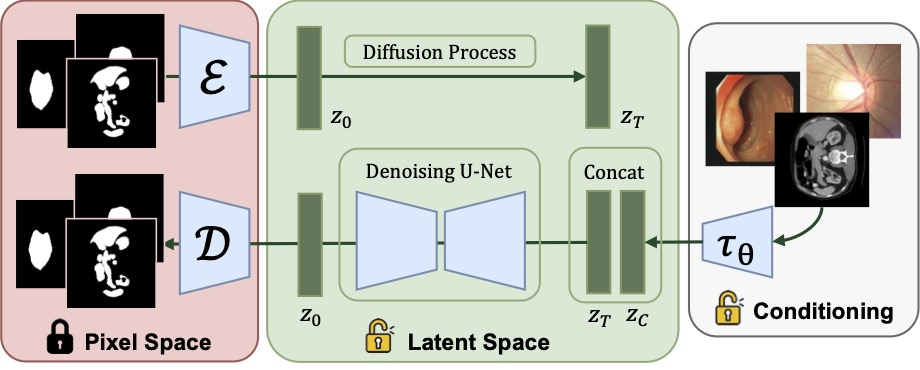

## Framework


The model is built on Latent Diffusion, with a downsampling-factor 8 autoencoder, a denoising UNet, and trainable vision encoder (with the same architecture of the encoder in the f=8 autoencoder).


## Requirements

A suitable [conda](https://conda.io/) environment named `sdseg` can be created
and activated with:

```bash
conda env create -f environment.yaml
conda activate sdseg
```

Then, install some dependencies by:
```bash
pip install -e git+https://github.com/CompVis/taming-transformers.git@master#egg=taming-transformers
pip install -e git+https://github.com/openai/CLIP.git@main#egg=clip
pip install -e .
```

    
<details>

### Pretrained Models
The model uses pre-trained weights from SD to initialize before training.

For pre-trained weights of the autoencoder and conditioning model, run

```bash
bash scripts/download_first_stages_f8.sh
```

For pre-trained wights of the denoising UNet, run

```bash
bash scripts/download_models_lsun_churches.sh
```


### Testing Scripts

After training an model, you should **manually modify the run paths** in `scripts/slice2seg.py`, and begin an inference process like

```bash
python -u scripts/slice2seg.py --dataset cvc
```


